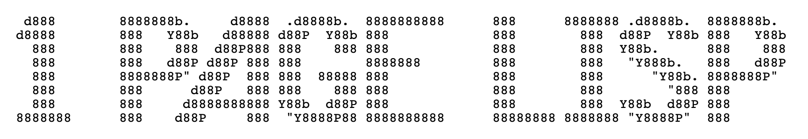

[1 Page Lisp is a learning project](https://github.com/claes-magnus/one-page-lisp). My goal was to write a minimalistic Lisp interpreter. With comments and unnecessary blanks removed, I wanted solutions that fit an a4, pretty-printed.

I find Lisp (and Lisp dialects such as Scheme) interesting, partly because it is so different from languages I know a bit better. Why not make an interpreter and at the same time learn more Lisp? 

In a computer programming language, a vision about how should think about abstractions and programming is embedded. Writing a compiler or an interpreter helps understanding how real, actually usable languages are built. It is an amazing experience to write such applications.

I've had lots of fun doing One Page Lisp. Currently, only the JavaScript version can handle lambdas and therefore I've chosen to focus on this version in this text. 

This small Lisp interpreter includes a REPL and can handle Lisp expressions such as:

```lisp
(define ((factorial (lambda (x) 
	(if (<= x 1) 
		1 
		(* x (factorial (- x 1))))))) 

(factorial 10))
```

My main source of inspiration is [Peter Norvig's simple Lisp interpreter, written in Python](https://norvig.com/lispy.html).

## Tokenize
Every interpreter begins by a stream of characters, a string. I will refer to this as input.

Before this input can become 'code' of programming language that may or may not solve a problem according to our intention, it needs classification. First, we need to scan the characters and break it into atoms. Such an atom of code is called a token. The pattern we use to identify the token is a lexeme.

What delimiters are used? In our Lisp interpreter, the following characters act as delimiters: `(`, `)`, `"` and whitespace.

The order is important in this context for `"` and whitespace. We say that the `"`-delimiter have precedence of whitespace to avoid issues related to strings. If `"` did not have precedence, a sentence would be impossible since we use whitespace to separate words.

```javascript
// Tokenize
function removeNoise(tokens) {
  return tokens.filter(
    token => token !== undefined && token.length > 0,
  );
}

function tokenize(input) {
  if (input.length === 0) {
    throw new Error('Unexpected EOF.');
  } else {
    return removeNoise(
      input.split(/(\()|(\))|\s+|(".+?")/)
    );
  }
}
```

## Parse
A stream of characters - the input - has transformed into tokens. Now we need to classify each token, but also build an Abstract Syntax Tree (AST) that maps how units relate to each other. The outcome - if the code and its inner relations are valid - is a hierarchical tree. This tree has a root and each level constitutes a node that either holds another branch or is a leaf, an end node.

Lisp has a few scalar data types. This minimalistic interpreter includes numbers, booleans, and identifiers (symbols). For the sake of simplicity, this interpreter ignores the fact that strings are considered to be a data structure in Lisp. Lists are inferred when evaluating the AST.

If the token is one of the scalar types of Lisp (including strings) we classify it as such. Besides special forms (lambda for instance), there are no functions as we know them from other languages. Lisp can perhaps be said to be a language of 'macros'.

```javascript
// Parse
function identifyType(token) {
  let tokenType = {};
  if (token[0] === '"') {
    tokenType = {
      type: 'string',
      value: token.slice(1, token.length - 1)
    };
  } else if (
      Number.isInteger(parseInt(token))
    ) {
    tokenType = {
      type: 'number',
      value: parseInt(token)
    };
  } else if (token === '#t' 
        || token === '#f'
    ) {
    tokenType = {
      type: 'boolean',
      value: token === '#t' 
        ? true 
        : false
    };
  } else {
    tokenType = {
      type: 'symbol',
      name: token
    };
  }
  return tokenType;
}
```

We build a tree by matching an opening and closing parenthesis. The left parenthesis opens a new branch, the right closes it. An open branch may include another branch. This interpreter uses a simplistic AST, an n-dimensional array. A branch is a dimension at a specific position in the array.

```
function parse(tokens, body = []) {
  if (tokens.length === 0) {
    return body.flat();
  }
  const token = tokens.shift();
  if (token === '(') {
    return parse(
      tokens, 
      body.concat([parse(tokens, [])])
    );
  } else if (token === ')') {
    return body;
  } else {
    return parse(
      tokens, 
      [
        ...body,
        identifyType(token)
      ]);
  }
}
```

We can imagine the levels with the use of this diagram. The number 0 is the root, and higher numbers are branches. Root has one branch (0). This branch holds another (1). The last branch (2) is a leaf, holding no data and no other branch.

```
( - ( - ( - ) - ) - )
0 - 1 - 2 - 2 - 1 - 0
```

After parsing we have an AST. A possible AST of this interpreter from the input is built from these steps.

```
> (+ 1 2 3)

// Tokens
['(', '+', '5', '2', '(', '-', '2', '1', ')', ')' ]

// AST
[
  [ 
	{ type: 'identifier', name: '+' } 
	{ type: 'number', value: 5 }
	{ type: 'number', value: 2 }
		[
			{ type: 'identifier', name: '-' }
			{ type: 'number', value: 2 }
			{ type: 'number', value: 1 }
		]
  ]
]
```

## Evaluate
We include a small standard library for performing normal features of a programming language. It includes basic logical and mathematical operations and some basic helpers. We could easily expand the standard library to include functions like `map`, `filter`, `reduce` and so on, but my feeling was that I would understand what I am doing better by not creating too many a distraction. 

```
// Evaluate
const HEAD = 0;

const standard_library = {
  '+': (...xs) => xs.reduce((a, b) => a + b),
  '-': (...xs) => xs.reduce((a, b) => a - b),
  '*': (...xs) => xs.reduce((a, b) => a * b),
  div: (x, y) => x / y,
  '>': (x, y) => x > y,
  '>=': (x, y) => x >= y,
  '<': (x, y) => x < y,
  '<=': (x, y) => x <= y,
  car: x => x[0],
  cdr: x => x.slice(1),
  len: x => x.length,
  cons: (...xs) => [...xs],
  'eq?': (x, y) => x === y,
  'empty?': (x) => x.length === 0,
  not: x => !x,
  or: (x, y) => x || y,
  and: (x, y) => x && y,
  append: (x, y) => y.length > 0 ? [...y, x] : [x],
  pop: (x) => x.length > 0? x.slice(0, x.length - 1) : []
};
```

When we use a lambda, this is similar to the anonymous function in JavaScript, Python and many other languages. It is a function that doesn't have an associated symbol. In Lisp, we would usually use the lambda together with define. However, there are other possible uses. 

Since we may use the lambda (this also is true for define) we want to save the context, the scope as well as information on the parent scope. Therefore we need a small helper that manages the environment and it's state in the children-parent relationship. At root, there is no parent.

```
function env(scope, parent) {
  return {
    scope,
    parent,
    get: symbol =>
      symbol in scope
        ? scope[symbol]
        : parent !== undefined && parent.get(symbol)
  };
}
```

`define` creates a local environment. Every symbol created here is associated with a value (an evaluated expression) and saved to this scope. We return the evaluation of a `define` call along with the expanded environment. If no scalar type or data structure is returned, `define` returns undefined.  

```
const specialForms = {
  define: ([ _, fnBody, fnCall ], context) => {
    const localEnv = env(standard_library, context);
    for (let [ { _, name }, expression ] of fnBody) {
      localEnv.scope[name] = evaluate(
        expression, 
        context
      );
    }
    return evaluate(fnCall, localEnv);
  },
```

A `lambda` is a function that take an arity of symbols, which are saved to the local scope and then evaluated with the function call and the created environment. 

```
  lambda: (
    [ _, fnBody, fnCall ], 
    context
  ) => (...lambdaArguments) => {
    const lambdaScope = fnBody.reduce(
      (acc, { _, name }, i) => ({
        ...acc,
        [name]: lambdaArguments[i]
      }),
      {}
    );
    return evaluate(
      fnCall, 
      env(lambdaScope, context)
    );
  },
```

I wanted something real with this interpreter. Or at least a basic algorithm. I've included `if` to make my life simpler in this ambition. Because Lisp uses recursion instead of the loops of imperative languages, `if` is particularly important. 

```
  'if': (
     [ 
       _, 
       condition, 
       consquence, 
       alternative
     ], 
     context
   ) => {
    const expression = evaluate(condition, context)
      ? consquence
      : alternative;
    return evaluate(expression, context);
  },
```

In Lisp, a list is evaluated if called. If we want to treat the list as data, we must use `quote`.

```
  'quote': ( [_, expression], context) => evaluate(expression, context)
};
```

The `evaluate` function takes input as an argument and a default argument that includes the standard library in the environment. We begin by returning `evaluate` if the input is undefined. This is important for the REPL; otherwise, it would break when we define a function and use them at a later stage.


```
function evaluate(
  input, 
  context = env(standard_library)
) {
  if (input === undefined) {
    return;
```

If the input is a list (an array) we handle this separate. Lisp has special forms. This interpreter has only four forms: `define`, `lambda`, `if` and `quote`. A special form is called with the input and the environment. 

If head of input is a special form, we evaluate the list and check if the head of the evaluated list is a function. If head is a function (returned at an earlier stage from the environment from a symbol), we separate it from the rest and apply the function to the list.
	
```
  } else if (Array.isArray(input)) {
    if (input.length > 0 
        && input[HEAD].name in specialForms
    ) {
      return specialForms[input[HEAD].name](input, context);
    } else {
      const evaluatedList = input.map(x => evaluate(x, context));
      if (evaluatedList[HEAD] instanceof Function) {
        const [fn, ...list] = evaluatedList;
        return fn(...list);
```

If no function occupy the head, the list is returned as it is. Since we've already evaluated the list we know that the list contains no subexpressions to be evaluated. In Lisp action - the application of a 'function', a manipulation of data - is always left-aligned in an expression. In Lisp we don't say `1 + 2 + 3`, but `(+ 1 2 3)`. 
	
```
      } else {
        return evaluatedList;
      }
    }
```

If input is of type symbol, we use the name as an identifier when we call the `get` method of `context`. This method may return a scalar value such as the string 'Tux', some function from the standard library (called upon when in an evaluated expression) or an user defined symbol associated to the environment in a local context.

Numbers, strings and booleans are returned as they are. If the input is not undefined, a list or of type symbol, number, string or boolean an error is thrown.

```
  } else if (input.type === 'symbol') {
    return context.get(input.name);
  } else if (
    input.type === 'number' ||
    input.type === 'string' ||
    input.type === 'boolean'
  ) {
    return input.value;
  } else {
    throw new Error('Unallowed character');
  }
}
```

The easiest way to get a sense of the limits of this Lisp intepreter is to look at the tests of the JavaScript solution.

Some random examples demonstrated by the tests:

```
(+ 1 2 3 (- 10 6))
=> 10

(car (quote (1 2 3)))
=> 1

(cdr (quote (1 2 3)))
=> [2, 3]

(define ((name "tux")) 
  (quote name))
=> tux

(define ((add-one (lambda (x) 
	(+ x 1)))) 
 (add-one (add-one 2)))
=> 4

(define ((factorial (lambda (x) 
	(if (<= x 1) 
		1 
		(* x (factorial (- x 1))))))) 
(factorial 10))
=> 3628800
```

You can also try the REPL.

```
> (define ((names ("tux" "nolok"))) (quote names))
[ 'tux', 'nolok' ]
```

In Lisp data is immutable. If you remove the last element of the list, this is the return 'value'. But `list-of-names` is not mutated.

```
> (pop names)
[ 'tux' ]
> (append "harry" names)
[ 'tux', 'nolok', 'harry' ]
```
Or using `cdr`, the rest operator of Lisp:

```
> (cdr (append "harry" names))
[ 'nolok', 'harry' ]
```

